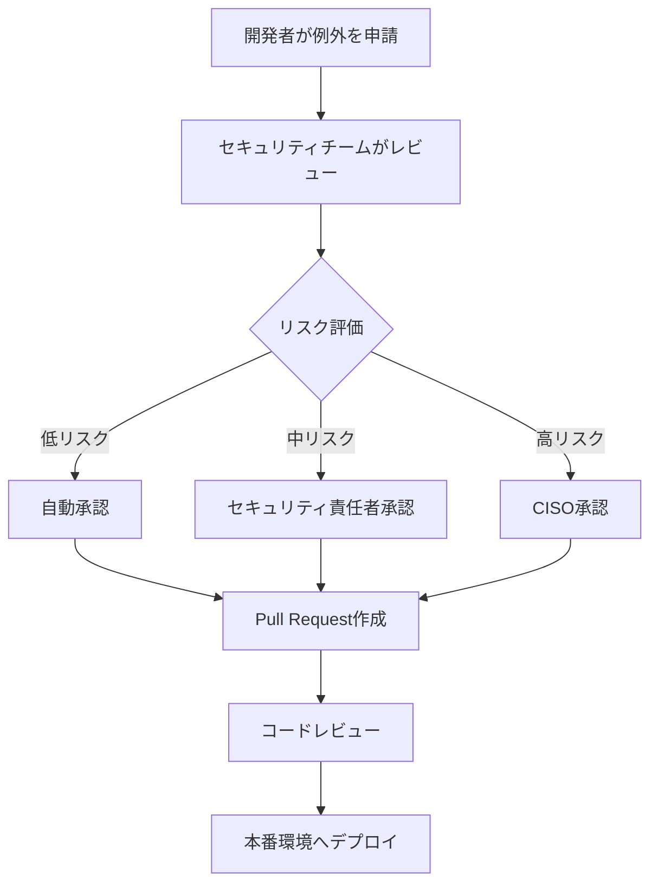

# 本番環境にFalcoを入れる時の設計

これまでの8回で、Falcoの基礎から実装まで学んできました。最終章では、**本番環境へのFalco導入設計**について、実運用の観点から詳しく解説します。

「動かす」ことと「運用する」ことは全く別物です。本番環境では、パフォーマンス、アラート疲れ、SREチームとの連携、コンプライアンス対応など、多くの考慮事項があります。

## この章で学ぶこと

- 本番環境導入の段階的アプローチ
- DaemonSetのリソース設計とパフォーマンス測定
- ノイズ削減とベースライン作成の戦略
- SREチームとの連携方法（オンコール、ランブック、エスカレーション）
- K8s distribution別の注意点（EKS/GKE/AKS/自己管理クラスタ）
- マルチクラスタ管理とコンプライアンス対応

---

## 本番環境導入の考え方

### 段階的なロールアウト

本番環境への導入は、**一気に全環境に展開するのではなく、段階的に進める**ことが鉄則です。

**推奨される導入ステップ**：

```
Phase 0: 開発環境での検証（1-2週間）
  ↓
Phase 1: ステージング環境でのパイロット運用（2-4週間）
  ↓
Phase 2: 本番環境の一部クラスタ（Canary展開、1-2週間）
  ↓
Phase 3: 本番環境の全クラスタ（段階的展開、2-4週間）
  ↓
Phase 4: 継続的な改善とチューニング（常時）
```

各フェーズで以下を確認：
- リソース消費量（CPU/メモリ）
- 誤検知の割合
- SREチームのフィードバック
- インシデント対応の実効性

### リスク管理

本番環境にFalcoを導入する際の主なリスク：

| リスク | 影響度 | 軽減策 |
|--------|--------|--------|
| **パフォーマンス劣化** | 高 | リソース制限、eBPF使用、段階的展開 |
| **アラート疲れ** | 高 | ノイズ削減、適切な優先度設定、例外管理 |
| **運用負荷の増加** | 中 | 自動化、ランブック整備、オンコール体制 |
| **誤検知による業務中断** | 中 | ベースライン作成、段階的ルール有効化 |
| **セキュリティポリシーの矛盾** | 低 | 既存ポリシーとの整合性確認 |

**ロールバック計画**：

```bash
# Helmでの緊急ロールバック
helm rollback falco

# DaemonSetの無効化
kubectl scale daemonset falco --replicas=0 -n falco

# 特定ノードでの無効化
kubectl label node worker-node-1 falco=disabled
```

### チームとの調整

Falco導入には複数のチームが関わります。

**関係者マトリクス**：

| チーム | 役割 | 調整事項 |
|--------|------|----------|
| **セキュリティチーム** | ポリシー策定、ルール作成 | 検知すべき脅威の定義 |
| **SREチーム** | 運用、インシデント対応 | オンコール体制、アラート設計 |
| **開発チーム** | アプリケーションの例外管理 | 正当な動作の定義、例外申請 |
| **インフラチーム** | クラスタ管理、リソース調整 | ノード選択、リソース割り当て |
| **コンプライアンスチーム** | 監査証跡、レポーティング | ログ保存期間、監査要件 |

**キックオフミーティングで決めること**：
- 導入スケジュール
- 責任分界点（RACI）
- エスカレーションフロー
- 成功の定義（KPI）

---

## DaemonSetのリソース設計

### CPU/メモリ要件

Falcoのリソース消費は、**監視対象のワークロード量**と**有効なルール数**に比例します。

**推奨リソース設定（ワークロード規模別）**：

#### 小規模環境（1ノードあたり10-30 Pod）

```yaml
resources:
  requests:
    cpu: 100m
    memory: 256Mi
  limits:
    cpu: 500m
    memory: 512Mi
```

#### 中規模環境（1ノードあたり30-70 Pod）

```yaml
resources:
  requests:
    cpu: 200m
    memory: 512Mi
  limits:
    cpu: 1000m
    memory: 1Gi
```

#### 大規模環境（1ノードあたり70+ Pod）

```yaml
resources:
  requests:
    cpu: 500m
    memory: 1Gi
  limits:
    cpu: 2000m
    memory: 2Gi
```

**実測データ例（本番環境）**：

```
環境: GKE クラスタ（100ノード、各ノード50 Pod平均）
ドライバー: eBPF
有効ルール数: 約120ルール

平均リソース消費（ノードあたり）:
- CPU: 150m（平常時）、300m（ピーク時）
- メモリ: 400Mi（平常時）、600Mi（ピーク時）
```

### ノードセレクタとToleration

本番環境では、**全ノードにFalcoを配置すべきかどうか**を検討します。

#### パターン1: 全ノードに配置（推奨）

```yaml
# falco-values.yaml
daemonset:
  tolerations:
    - effect: NoSchedule
      operator: Exists
    - effect: NoExecute
      operator: Exists
```

**メリット**：完全な可視性
**デメリット**：リソース消費が大きい

#### パターン2: 本番ワークロード専用ノードのみ

```yaml
# falco-values.yaml
daemonset:
  nodeSelector:
    workload-type: production
  tolerations:
    - key: workload-type
      operator: Equal
      value: production
      effect: NoSchedule
```

**メリット**：リソース節約
**デメリット**：監視の死角が生まれる

#### パターン3: セキュリティセンシティブなワークロード専用

```yaml
# falco-values.yaml
daemonset:
  affinity:
    nodeAffinity:
      requiredDuringSchedulingIgnoredDuringExecution:
        nodeSelectorTerms:
        - matchExpressions:
          - key: security-level
            operator: In
            values:
            - high
            - critical
```

**ユースケース**：決済システム、個人情報処理など

### パフォーマンスへの影響測定

#### 測定前の準備

```bash
# 1. ベンチマーク用のワークロード準備
kubectl apply -f benchmark-workload.yaml

# 2. Prometheusメトリクスの確認
kubectl port-forward -n falco svc/falco-metrics 8765:8765
curl http://localhost:8765/metrics | grep falco_events_total
```

#### 測定項目

| 指標 | 測定方法 | 許容値 |
|------|----------|--------|
| **CPU使用率** | node_cpu_usage | 導入前後で+5%以内 |
| **メモリ使用率** | node_memory_usage | 導入前後で+10%以内 |
| **レイテンシー** | アプリケーションメトリクス | 導入前後で+3%以内 |
| **スループット** | リクエスト/秒 | 導入前後で-2%以内 |

#### 負荷テスト例

```bash
# 本番相当の負荷をかける
hey -z 10m -c 100 https://api.example.com/health

# Falco有効/無効でのパフォーマンス比較
kubectl scale daemonset falco --replicas=0 -n falco
# 再度負荷テスト実行
```

**実測結果例**：

```
環境: EKS m5.2xlarge ノード
ワークロード: Nginx (100 req/sec)

Falco無効時:
- CPU: 1.2 cores
- Memory: 3.5 GB
- p99 レイテンシー: 45ms

Falco有効時 (eBPF):
- CPU: 1.35 cores (+12.5%)
- Memory: 3.8 GB (+8.6%)
- p99 レイテンシー: 47ms (+4.4%)

結論: 許容範囲内
```

---

## ノイズ削減戦略

本番環境で最も重要なのは、**誤検知を減らしてアラート疲れを防ぐ**ことです。

### フェーズ1: 観察モード（1-2週間）

**目的**：本番環境の正常な動作パターンを把握する

```yaml
# falco.yaml - 観察モードの設定
priority: NOTICE  # 全アラートをログに出すが、通知は抑制
output:
  rate: 0  # レート制限なし（全イベントを記録）
  max_burst: 0

json_output: true  # 分析しやすい形式
log_level: info
```

**観察すべき項目**：
- 最も頻繁に発火するルール（Top 10）
- 特定のNamespace/Podで集中するアラート
- 時間帯による傾向（日中vs夜間）

**分析クエリ例（Elasticsearch）**：

```json
GET /falco-*/_search
{
  "size": 0,
  "aggs": {
    "top_rules": {
      "terms": {
        "field": "rule.keyword",
        "size": 20
      }
    }
  }
}
```

### フェーズ2: ベースライン作成（1週間）

**目的**：正常動作を定義し、例外ルールを作成する

#### 例1: CI/CDパイプラインの例外

```yaml
# custom-rules.yaml
- rule: Terminal shell in container
  exceptions:
    - name: ci_cd_runners
      fields: [container.image.repository, k8s.ns.name]
      comps: [=, =]
      values:
        - [gitlab-runner, gitlab-system]
        - [jenkins-agent, jenkins]
```

#### 例2: 特定アプリケーションの正当なファイルアクセス

```yaml
- rule: Write below etc
  exceptions:
    - name: config_management
      fields: [proc.name, fd.name]
      comps: [=, startswith]
      values:
        - [config-sync, /etc/app/config]
```

#### 例3: kubectl execの許可（開発者アクセス）

```yaml
- rule: Attach/Exec Pod
  exceptions:
    - name: developer_access
      fields: [k8s.ns.name, ka.user.name]
      comps: [=, in]
      values:
        - [development, ["alice@example.com", "bob@example.com"]]
```

### フェーズ3: 段階的有効化（2-4週間）

**ルールの優先度別ロールアウト**：

```
Week 1: CRITICAL のみ有効化
  ↓
Week 2: CRITICAL + ERROR
  ↓
Week 3: CRITICAL + ERROR + WARNING（一部）
  ↓
Week 4: 全ルール有効化 + 継続的調整
```

**優先度ベースのフィルタリング**：

```yaml
# falco-config.yaml
priority: ERROR  # WARNING以下は無視
```

### フェーズ4: 継続的改善

#### アラート疲れの指標

```
1. 1日あたりのアラート数 > 100件 → ノイズが多すぎる
2. 同じルールが1時間に10回以上 → 例外設定が必要
3. アラート対応率 < 30% → 優先度の見直しが必要
```

#### ノイズ削減のベストプラクティス

| 手法 | 効果 | 実装難易度 |
|------|------|------------|
| **Namespace除外** | 高 | 低 |
| **Label-based除外** | 高 | 低 |
| **time-based除外** | 中 | 中 |
| **rate limiting** | 中 | 低 |
| **機械学習（異常検知）** | 高 | 高 |

#### Namespace単位の除外例

```yaml
- macro: trusted_namespaces
  condition: >
    (k8s.ns.name in (kube-system, kube-public, istio-system, monitoring))

- rule: Launch Privileged Container
  condition: >
    container_started and container.privileged=true
    and not trusted_namespaces
  output: Privileged container started (ns=%k8s.ns.name pod=%k8s.pod.name)
  priority: WARNING
```

---

## 例外管理の戦略

### 例外の分類

#### 1. 恒久的な例外（アーキテクチャ上必要）

**例**：Istio Envoy ProxyがPod内でptrace syscallを使用

```yaml
- list: istio_proxy_images
  items: [gcr.io/istio-release/proxyv2]

- rule: PTRACE attached to process
  exceptions:
    - name: istio_sidecar
      fields: [container.image.repository]
      comps: [in]
      values:
        - [istio_proxy_images]
```

#### 2. 一時的な例外（移行期間中のみ）

**例**：レガシーアプリケーションのroot実行（6ヶ月後に廃止予定）

```yaml
- rule: Launch Privileged Container
  exceptions:
    - name: legacy_app_migration
      fields: [container.image.repository, k8s.ns.name]
      comps: [=, =]
      values:
        - [legacy-app, production]
      # TODO: 2025年6月30日までに削除
```

#### 3. 緊急時の例外（インシデント対応）

**例**：本番環境での緊急デバッグ

```bash
# 一時的にルールを無効化
kubectl edit configmap falco-config -n falco

# または、特定Namespaceを除外
kubectl label namespace production falco-exclude=true
```

### 例外の承認プロセス



**例外申請テンプレート（GitHub Issue）**：

```markdown
## 例外申請

### 基本情報
- 申請者: @alice
- チーム: Payment Platform
- 日付: 2025-01-15

### 例外の詳細
- ルール名: `Write below etc`
- 対象リソース: `payment-service` (namespace: `production`)
- 理由: アプリケーションがランタイムに `/etc/app/config.json` を更新する必要がある

### リスク評価
- セキュリティリスク: 低（設定ファイルのみ、実行ファイルは対象外）
- 代替策: 検討したが、アーキテクチャ変更が必要（Q2に対応予定）
- 期限: 2025年6月30日まで（レガシー移行完了後に廃止）

### 承認
- [ ] セキュリティチーム
- [ ] SREチーム
- [ ] CISO（高リスクの場合のみ）
```

### 例外のドキュメント化

**例外管理台帳（Spreadsheet）**：

| ID | ルール | 対象 | 理由 | リスク | 承認者 | 期限 | ステータス |
|----|--------|------|------|--------|--------|------|------------|
| EX-001 | Write below etc | payment-service | 設定更新 | 低 | alice@example.com | 2025-06-30 | Active |
| EX-002 | Privileged Container | istio-proxy | サイドカー | 低 | - | 恒久 | Active |
| EX-003 | Shell in container | debug-pod | 緊急対応 | 高 | ciso@example.com | 2025-01-20 | Expired |

**定期レビュー**：
- 月次：期限切れ例外のクリーンアップ
- 四半期：全例外の正当性レビュー
- 年次：例外数の削減目標設定

---

## SREチームとの連携

### オンコール体制の整備

**アラートの重要度別対応**：

| Priority | 対応時間 | 対応者 | アクション |
|----------|----------|--------|------------|
| **EMERGENCY** | 即座 | オンコールSRE | ページング、即時対応 |
| **CRITICAL** | 15分以内 | オンコールSRE | Slack通知、1時間以内に調査 |
| **WARNING** | 営業時間内 | セキュリティチーム | チケット作成、翌営業日対応 |
| **NOTICE** | ログのみ | - | 定期レビュー時に確認 |

### PagerDuty/Opsgenie連携

#### Falcosidekickの設定

```yaml
# falcosidekick-values.yaml
config:
  pagerduty:
    enabled: true
    routingKey: "YOUR_ROUTING_KEY"
    minimumpriority: "critical"  # CRITICAL以上のみページング

  slack:
    enabled: true
    webhookurl: "https://hooks.slack.com/services/XXX"
    minimumpriority: "warning"  # WARNING以上をSlack通知

  opsgenie:
    enabled: true
    apikey: "YOUR_API_KEY"
    region: "us"
    priority: "P1"  # Opsgenieでの優先度
```

#### PagerDutyエスカレーションポリシー例

```
Level 1: プライマリオンコール（即座）
  ↓ 15分後に応答なし
Level 2: セカンダリオンコール（15分後）
  ↓ 30分後に応答なし
Level 3: セキュリティマネージャー（45分後）
  ↓ 1時間後に応答なし
Level 4: CTO/CISO（1時間15分後）
```

### ランブックの作成

#### 例：Privileged Containerアラートのランブック

```markdown
# ランブック: Privileged Container Detected

## アラート情報
- ルール: Launch Privileged Container
- 重要度: CRITICAL
- 説明: 特権コンテナが起動されました

## 初動対応（5分以内）

### 1. 状況確認
```bash
# アラート詳細を確認
kubectl get pod <POD_NAME> -n <NAMESPACE> -o yaml | grep -A 5 securityContext

# Podのイベント履歴
kubectl describe pod <POD_NAME> -n <NAMESPACE>
```

### 2. 緊急性の判断
- [ ] 既知の例外か？ → 例外リストを確認
- [ ] 正規のデプロイか？ → GitHubのデプロイ履歴を確認
- [ ] 攻撃の可能性は？ → 以下の兆候をチェック
  - 深夜帯の起動
  - 不審なイメージ名
  - 不明なユーザーによるデプロイ

### 3. 封じ込め（必要に応じて）
```bash
# Podの即時削除
kubectl delete pod <POD_NAME> -n <NAMESPACE> --force --grace-period=0

# Namespaceの隔離
kubectl label namespace <NAMESPACE> network-policy=isolated
```

## 詳細調査（30分以内）

### 1. 誰がデプロイしたか
```bash
# Audit Logから確認
kubectl get events --all-namespaces --sort-by='.lastTimestamp' | grep <POD_NAME>
```

### 2. コンテナ内部の確認（安全な環境で）
```bash
# イメージの検査
docker pull <IMAGE>
docker history <IMAGE>
docker run --rm -it <IMAGE> /bin/sh
```

### 3. 影響範囲の特定
```bash
# 同じイメージを使用している他のPod
kubectl get pods --all-namespaces -o json | jq '.items[] | select(.spec.containers[].image=="<IMAGE>")'
```

## エスカレーション

- 攻撃の可能性が高い → セキュリティインシデント対応チームに即座にエスカレーション
- 既知のバグ → 開発チームにチケット作成
- 例外設定が必要 → セキュリティチームに例外申請

## 事後対応

- [ ] インシデントレポート作成
- [ ] ポストモーテム実施（必要に応じて）
- [ ] ルールまたは例外の更新
- [ ] 再発防止策の実施
```

### エスカレーションフロー

```yaml
# falcosidekick-values.yaml - エスカレーション設定
config:
  customfields:
    runbook_url: "https://wiki.example.com/runbooks/falco"
    escalation_policy: "security-team"
    slack_channel: "#security-alerts"

  slack:
    enabled: true
    webhookurl: "https://hooks.slack.com/services/XXX"
    messageformat: |
      :rotating_light: *Falco Alert*
      *Rule:* {{.Rule}}
      *Priority:* {{.Priority}}
      *Pod:* {{.OutputFields.k8s.pod.name}} ({{.OutputFields.k8s.ns.name}})
      *Runbook:* https://wiki.example.com/runbooks/falco/{{.Rule}}
```

---

## K8s Distributionごとの注意点

### Amazon EKS

#### セットアップ

```bash
# 1. EKS クラスタ情報確認
aws eks describe-cluster --name my-cluster --region us-west-2

# 2. Helm インストール
helm repo add falcosecurity https://falcosecurity.github.io/charts
helm repo update

# 3. EKS 専用設定でインストール
helm install falco falcosecurity/falco \
  --namespace falco --create-namespace \
  --set driver.kind=ebpf \
  --set ebpf.hostNetwork=true \
  --set falcosidekick.enabled=true \
  --set falcosidekick.webui.enabled=true
```

#### EKS固有の注意点

**1. Bottlerocketに対応**

EKSでBottlerocketノードを使用している場合：

```yaml
# falco-values.yaml
driver:
  kind: ebpf  # Bottlerocketではカーネルモジュール非対応

ebpf:
  path: /sys/fs/bpf
```

**2. AWS-specific Falco Rules**

```yaml
# aws-rules.yaml
- rule: AWS Metadata Service Access
  desc: Detectアクセス to AWS metadata service (IMDS)
  condition: >
    outbound and fd.sip=169.254.169.254 and
    not container.image.repository in (aws_allowed_images)
  output: >
    AWS metadata accessed (pod=%k8s.pod.name ns=%k8s.ns.name
    image=%container.image.repository)
  priority: WARNING
```

**3. EKS Audit Log連携**

```bash
# CloudWatch Logs → Kinesis → Lambda → Falco
aws eks update-cluster-config \
  --name my-cluster \
  --logging '{"clusterLogging":[{"types":["audit"],"enabled":true}]}'
```

### Google GKE

#### セットアップ

```bash
# 1. GKE クラスタ情報確認
gcloud container clusters describe my-cluster --region us-central1

# 2. COS (Container-Optimized OS) 対応
helm install falco falcosecurity/falco \
  --namespace falco --create-namespace \
  --set driver.kind=ebpf \
  --set ebpf.lsm=lsm \
  --set falco.grpc.enabled=true
```

#### GKE固有の注意点

**1. GKE Autopilot対応**

Autopilotモードでは制約があります：

```yaml
# falco-values-autopilot.yaml
driver:
  kind: ebpf  # 必須

daemonset:
  priorityClassName: system-node-critical  # 必須

resources:
  limits:
    memory: 1Gi  # Autopilotの制限内
```

**2. GKE Dataplane V2 (Cilium) との共存**

```yaml
# Cilium eBPFとFalco eBPFの競合を避ける
ebpf:
  path: /sys/fs/bpf/falco  # 専用パスを使用
```

**3. GKE Audit Log連携**

```bash
# Cloud Logging → Pub/Sub → Falco
gcloud logging sinks create falco-audit \
  pubsub.googleapis.com/projects/PROJECT_ID/topics/falco-audit \
  --log-filter='protoPayload.serviceName="k8s.io"'
```

### Azure AKS

#### セットアップ

```bash
# 1. AKS クラスタ情報確認
az aks show --resource-group myResourceGroup --name myAKSCluster

# 2. AKS 用インストール
helm install falco falcosecurity/falco \
  --namespace falco --create-namespace \
  --set driver.kind=ebpf \
  --set falco.grpc.enabled=true \
  --set falco.grpc_output.enabled=true
```

#### AKS固有の注意点

**1. Azure Linux対応**

```yaml
# AKS で Azure Linux (Mariner) を使用している場合
driver:
  kind: ebpf  # 推奨

ebpf:
  hostNetwork: true
```

**2. AKS Audit Log連携**

```bash
# Azure Monitor → Event Hub → Falco
az aks enable-addons \
  --resource-group myResourceGroup \
  --name myAKSCluster \
  --addons monitoring
```

**3. AKS Network Policyとの共存**

```yaml
# Azure CNI使用時の設定
daemonset:
  podAnnotations:
    azure.network.policy: "allow-all"  # Falco DaemonSetは全トラフィック許可
```

### 自己管理クラスタ（kOps/kubeadm等）

#### セットアップ

```bash
# カーネルモジュール方式（推奨）
helm install falco falcosecurity/falco \
  --namespace falco --create-namespace \
  --set driver.kind=module \
  --set driver.loader.initContainer.enabled=true
```

#### 注意点

**1. カーネルヘッダーの準備**

```bash
# 各ノードで実行
apt-get install -y linux-headers-$(uname -r)  # Debian/Ubuntu
yum install -y kernel-devel-$(uname -r)       # RHEL/CentOS
```

**2. マルチディストリビューション対応**

```yaml
# 異なるOSが混在する場合
driver:
  kind: ebpf  # 互換性が高い
  loader:
    initContainer:
      enabled: true
      image:
        repository: falcosecurity/falco-driver-loader
        tag: latest
```

---

## マルチクラスタ管理

### 中央集権的な監視

**アーキテクチャ例**：

```
┌─────────────────────────────────────────────────────┐
│              Central Monitoring                      │
│  ┌────────────┐  ┌────────────┐  ┌──────────────┐  │
│  │Elasticsearch│  │  Grafana   │  │ Falco UI     │  │
│  └──────▲─────┘  └──────▲─────┘  └──────▲───────┘  │
│         │                │                │          │
└─────────┼────────────────┼────────────────┼──────────┘
          │                │                │
    ┌─────┴────────────────┴────────────────┴─────┐
    │           Message Bus (Kafka/Kinesis)        │
    └─────┬────────────────┬────────────────┬──────┘
          │                │                │
┌─────────▼─────┐ ┌────────▼────┐ ┌────────▼─────┐
│ Cluster A     │ │ Cluster B    │ │ Cluster C    │
│  - Falco      │ │  - Falco     │ │  - Falco     │
│  - Falcosidekick│ │  - Falcosidekick│ │  - Falcosidekick│
└───────────────┘ └──────────────┘ └──────────────┘
```

#### 実装例（Kafka経由）

```yaml
# falcosidekick-values.yaml (各クラスタ)
config:
  kafka:
    enabled: true
    hostport: kafka.central.svc.cluster.local:9092
    topic: falco-alerts
    sasl:
      enabled: true
      username: falco-user
      password: ${KAFKA_PASSWORD}

  customfields:
    cluster_name: "production-us-west-2"  # クラスタ識別子
    environment: "production"
    region: "us-west-2"
```

### クラスタ横断的なポリシー管理

**GitOps によるポリシー配布**：

```
┌─────────────────────────────────────────────┐
│         GitHub Repository                    │
│  ├── base/                                   │
│  │   ├── falco-rules.yaml  (共通ルール)     │
│  │   └── kustomization.yaml                 │
│  ├── overlays/                               │
│  │   ├── production/                         │
│  │   │   ├── falco-rules-prod.yaml          │
│  │   │   └── kustomization.yaml             │
│  │   └── staging/                            │
│  │       ├── falco-rules-staging.yaml       │
│  │       └── kustomization.yaml             │
└─────────────────────────────────────────────┘
          │
          │ (Flux CD / ArgoCD)
          ▼
┌─────────────────────────────────────────────┐
│     複数クラスタへ自動デプロイ               │
└─────────────────────────────────────────────┘
```

#### Kustomize設定例

```yaml
# base/kustomization.yaml
apiVersion: kustomize.config.k8s.io/v1beta1
kind: Kustomization
resources:
  - falco-rules.yaml

# overlays/production/kustomization.yaml
apiVersion: kustomize.config.k8s.io/v1beta1
kind: Kustomization
bases:
  - ../../base
patchesStrategicMerge:
  - falco-rules-prod.yaml  # 本番環境固有のルール追加
```

### スケーラビリティの考慮

**イベント量の見積もり**：

```
1クラスタあたり:
- ノード数: 100
- Pod数: 5,000
- Falcoイベント: 平均 1,000 events/sec

10クラスタの場合:
- 総イベント: 10,000 events/sec
- ストレージ(Elasticsearch): 約 5TB/月
```

**スケーリング戦略**：

| 規模 | クラスタ数 | アーキテクチャ | 推奨構成 |
|------|-----------|---------------|----------|
| 小規模 | 1-5 | 単一Elasticsearch | 3ノードクラスタ |
| 中規模 | 5-20 | Kafka + Elasticsearch | 5ノード + Kafka 3ブローカー |
| 大規模 | 20+ | Kafka + 複数ES + S3アーカイブ | Dedicated infrastructure |

---

## コンプライアンス対応

### PCI-DSS

**PCI-DSS要件とFalcoの対応**：

| 要件 | 内容 | Falcoでの実装 |
|------|------|---------------|
| **10.2.2** | ファイルへの管理者アクセス監視 | `Read sensitive file untrusted` ルール |
| **10.2.5** | アクセス制御メカニズムの不正使用 | `Change thread namespace` ルール |
| **10.6.1** | ログの定期レビュー | Elasticsearch + 自動レポート |
| **11.5** | ファイル整合性監視 | `Detect crypto miners` ルール |

#### PCI-DSS用カスタムルール例

```yaml
# pci-dss-rules.yaml
- rule: PCI-DSS - Cardholder Data Access
  desc: Detect access to cardholder data environments
  condition: >
    open_read and
    fd.name startswith /var/data/cardholder and
    not proc.name in (authorized_apps)
  output: >
    PCI-DSS Violation: Cardholder data accessed
    (user=%user.name process=%proc.name file=%fd.name)
  priority: CRITICAL
  tags: [pci-dss, requirement-10.2.2]
```

### SOC 2

**SOC 2コントロールとFalcoの対応**：

| コントロール | 内容 | Falcoでの実装 |
|-------------|------|---------------|
| **CC6.1** | 論理的・物理的アクセス管理 | 特権コンテナ検知 |
| **CC6.6** | 脆弱性管理 | Runtime脆弱性検知 |
| **CC7.2** | システム監視 | 24/7リアルタイム監視 |

#### 監査証跡の保存

```yaml
# falcosidekick-values.yaml
config:
  elasticsearch:
    enabled: true
    hostport: https://es.example.com:9200
    index: falco-audit
    type: _doc
    minimumpriority: "notice"  # すべてのイベントを保存

    # SOC 2要件: 90日間保存
    customHeaders:
      X-Retention-Days: "90"
```

### GDPR

**GDPR第32条（セキュリティ対策）への対応**：

```yaml
# gdpr-rules.yaml
- rule: GDPR - Personal Data Exfiltration
  desc: Detect potential personal data exfiltration
  condition: >
    outbound and
    fd.name contains "personal_data" and
    not fd.sip in (trusted_destinations)
  output: >
    GDPR Alert: Potential data exfiltration detected
    (pod=%k8s.pod.name dest=%fd.sip file=%fd.name)
  priority: CRITICAL
  tags: [gdpr, article-32]
```

**データ保護影響評価（DPIA）対応**：

- Falcoが収集するデータ: システムコールメタデータ（個人情報は含まない）
- 保存期間: 90日（設定可能）
- アクセス制御: RBACによる制限
- 暗号化: TLS通信、保管時暗号化

---

## 本番環境チェックリスト

### デプロイ前

- [ ] **リソース設計の完了**
  - [ ] CPU/メモリ要件の算出
  - [ ] ノードセレクタ/Tolerationの設定
  - [ ] パフォーマンステストの実施

- [ ] **ノイズ削減の実施**
  - [ ] 観察モードでのベースライン作成（1-2週間）
  - [ ] 例外ルールの作成
  - [ ] Priority設定の調整

- [ ] **ルールの整備**
  - [ ] カスタムルールのレビュー
  - [ ] デフォルトルールの有効/無効判断
  - [ ] 環境固有ルールの追加

- [ ] **通知設定**
  - [ ] Falcosidekickの設定
  - [ ] Slack/PagerDuty連携
  - [ ] アラートルーティングの設定

### デプロイ時

- [ ] **段階的展開**
  - [ ] ステージング環境での動作確認
  - [ ] Canary展開（本番1クラスタ）
  - [ ] 全クラスタへの段階的展開

- [ ] **モニタリング**
  - [ ] Prometheusメトリクスの確認
  - [ ] リソース消費の監視
  - [ ] アラート発火状況の確認

- [ ] **ロールバック準備**
  - [ ] ロールバック手順の確認
  - [ ] 緊急時の連絡先リスト
  - [ ] 意思決定者の明確化

### デプロイ後

- [ ] **運用体制の整備**
  - [ ] オンコール体制の確立
  - [ ] ランブックの作成・共有
  - [ ] エスカレーションフローの確認

- [ ] **ドキュメント整備**
  - [ ] 運用手順書
  - [ ] トラブルシューティングガイド
  - [ ] 例外管理台帳

- [ ] **継続的改善**
  - [ ] 週次: アラートレビュー
  - [ ] 月次: ルール最適化
  - [ ] 四半期: 全体レビュー

### コンプライアンス

- [ ] **監査対応**
  - [ ] ログ保存期間の設定
  - [ ] アクセス制御の実施
  - [ ] 監査証跡の確保

- [ ] **レポーティング**
  - [ ] 月次セキュリティレポート
  - [ ] インシデント対応記録
  - [ ] コンプライアンスレポート

---

## まとめ

この章では、本番環境へのFalco導入設計について学びました。

**重要なポイント**：

1. **段階的なロールアウト**：一気に展開せず、フェーズを分けて慎重に
2. **ノイズ削減が最優先**：アラート疲れを防ぐために、観察期間を十分に取る
3. **チーム間の連携**：SRE、セキュリティ、開発チームの協力が不可欠
4. **継続的な改善**：デプロイして終わりではなく、運用しながら最適化
5. **コンプライアンス対応**：監査要件を満たすログ保存と証跡管理

**本番環境での成功の鍵**：

```
技術的な正確性 × チーム間の調整 × 継続的な改善 = 成功する運用
```

最終章（第10回）では、Falcoの発展系として、OPA Gatekeeper、Kyvernoとの比較、そしてFalcoの未来について学びます。

---

## 参考資料

### 公式ドキュメント
- [Falco Best Practices](https://falco.org/docs/best-practices/)
- [Falco Performance Tuning](https://falco.org/docs/performance/)
- [Falco Rules Best Practices](https://falco.org/docs/rules/best-practices/)

### プラットフォーム固有
- [Running Falco on EKS](https://aws.amazon.com/blogs/containers/implementing-runtime-security-in-amazon-eks-using-cncf-falco/)
- [Falco on GKE Autopilot](https://cloud.google.com/kubernetes-engine/docs/concepts/autopilot-security)
- [Azure AKS Security Best Practices](https://learn.microsoft.com/en-us/azure/aks/operator-best-practices-cluster-security)

### コンプライアンス
- [PCI-DSS Requirements](https://www.pcisecuritystandards.org/)
- [SOC 2 Compliance Guide](https://www.aicpa.org/soc2)
- [GDPR Security Measures](https://gdpr.eu/article-32-security-of-processing/)

### 運用事例
- [Falco Production Deployment at Scale](https://sysdig.com/blog/falco-at-scale/)
- [Multi-cluster Falco Architecture](https://github.com/falcosecurity/falco/blob/master/proposals/20210119-falco-grpc-api.md)
